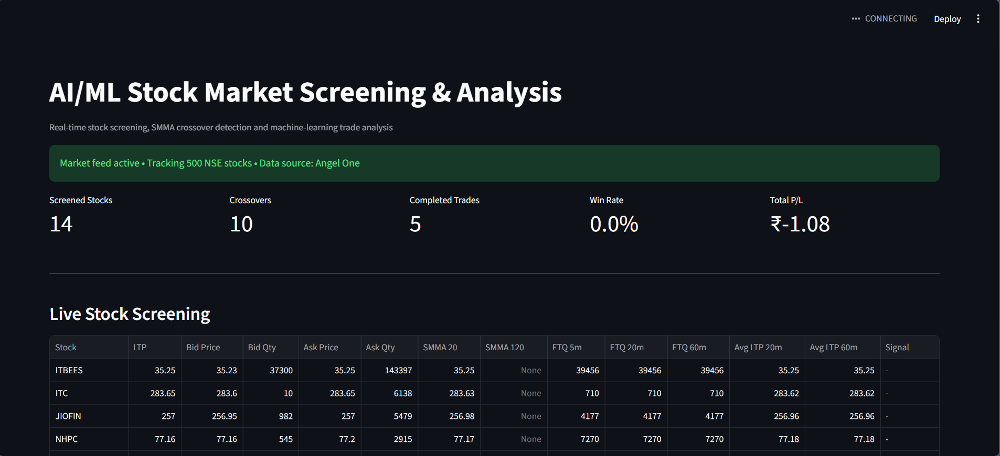
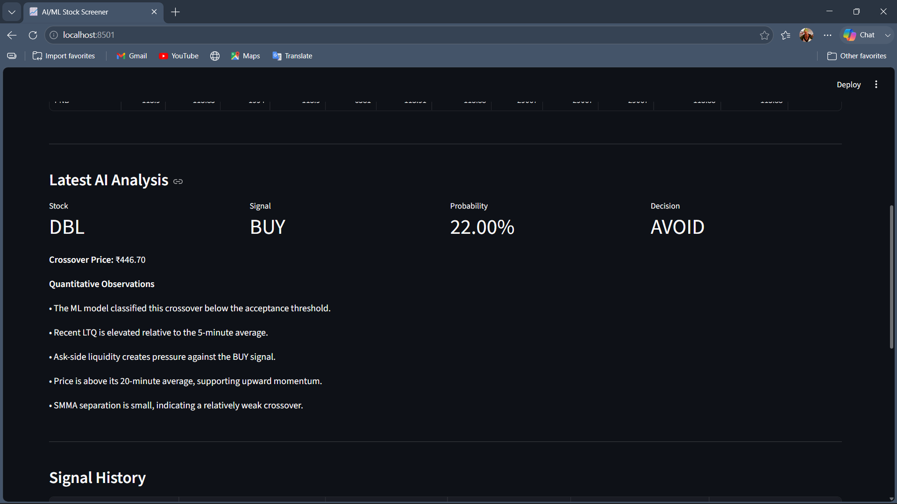
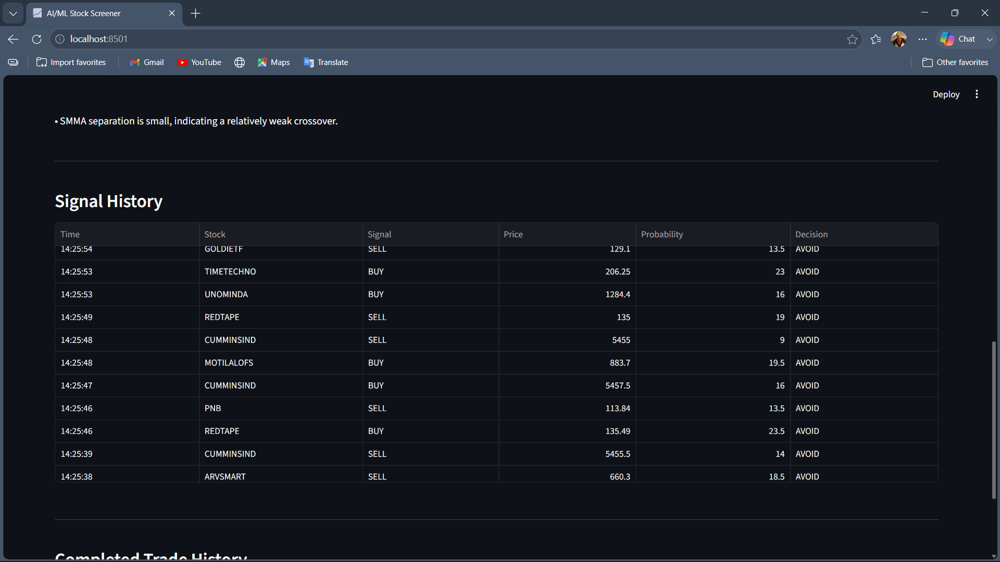

# 📈 AI/ML Stock Market Screener

## 🎯 What This Project Does

A real-time stock screening and decision-support system for NSE equities.

It receives live market ticks through the Angel One SmartAPI WebSocket, processes each tick through a modular analysis pipeline, filters stocks using configurable price/liquidity rules, calculates rolling market metrics, maintains SMMA 20 / SMMA 120, detects BUY/SELL crossovers, generates ML features, and evaluates crossover events using a trained machine-learning model.

A Streamlit dashboard brings the complete pipeline together in a live interface.

## Live Demo
```
https://ai-stock-screener-by-arman.streamlit.app/
```

## Notice

Market closes around 4:00 pm so then API Key will not work after market closes. You will get live updates on next day then, when market starts...


### Core Pipeline

```
                    ANGEL ONE SMARTAPI
                           │
                           ▼
                 Live WebSocket Feed
                           │
                           ▼
                Instrument / Token Map
                           │
                           ▼
                     Market Tick
                           │
              ┌────────────┼────────────┐
              ▼            ▼            ▼
          Screening   Rolling Metrics   SMMA
              │            │          20 / 120
              └────────────┼────────────┘
                           ▼
                  Crossover Detection
                           │
                           ▼
                    Feature Engine
                           │
                           ▼
                 ML Crossover Model
                           │
                  ┌────────┴────────┐
                  ▼                 ▼
               ACCEPT             AVOID
                  │
                  ▼
                Trade
               Tracking
                  │
                  ▼
            Streamlit Dashboard
```

---

## ✨ Key Features

### 📡 Real-Time Market Data

- Angel One SmartAPI authentication with TOTP
- Real-time NSE WebSocket market feed
- Last traded price (LTP) and last traded quantity (LTQ)
- Best bid/ask price and quantity
- Total buy/sell market quantities
- Dynamic Angel One instrument-master loading with symbol-to-token mapping
- Multi-stock WebSocket subscription

### 🔎 Stock Screening

Stocks are filtered before deeper analysis using configurable conditions:

- Minimum / maximum stock price
- Minimum buy-side liquidity
- Minimum sell-side liquidity

This prevents every incoming stock tick from unnecessarily entering the downstream analysis pipeline.

### 📊 Rolling Market Metrics

The system maintains rolling tick history and calculates:

- ETQ over 5, 20, and 60 minutes
- Average LTP over 20 and 60 minutes
- Average LTQ and short-term LTQ ratios
- Bid/ask pressure
- Price position relative to rolling averages

### 📈 SMMA 20 / SMMA 120

The Smoothed Moving Average is implemented from scratch and maintained independently for each stock (SMMA 20 and SMMA 120). These indicators form the basis of the crossover detection layer.

### 🔀 Crossover Detection

The crossover engine identifies actual changes in the relationship between SMMA 20 and SMMA 120:

```
SMMA 20
     /
    /
   /      ← BUY crossover
--/---------------- SMMA 120

SMMA 120
----------------\
                  \
                   \  ← SELL crossover
                    \
                   SMMA 20
```

The detector stores previous indicator values so it does not simply treat every `SMMA20 > SMMA120` state as a new signal.

### 🤖 Machine Learning Signal Analysis

When a crossover occurs, the feature engine builds a quantitative feature vector. Current model features:

- `ltq_avg_2m`, `ltq_avg_5m`, `ltq_ratio_2m_5m`
- `etq_5m`, `etq_20m`, `etq_ratio_5m_20m`
- `bid_ask_ratio`
- `smma_distance_pct`
- `price_vs_avg20`, `price_vs_avg60`
- `signal_direction`

The trained model returns a probability, a confidence percentage, an ACCEPT/AVOID decision, and quantitative observations explaining the decision. The acceptance threshold is configurable and defaults to **60%**.

### 💼 Analytical Trade Tracking

The trade tracker records crossover-based paper trades: direction, entry/exit price, entry/exit timestamp, P/L, and profit/loss result.

> ⚠️ No real orders are placed. Trade tracking is analytical/paper-trading logic only.

### 🖥️ Live Streamlit Dashboard

- Market feed status and screened stocks
- LTP, bid/ask data
- SMMA 20 / SMMA 120, ETQ metrics, rolling average LTP
- Latest ML analysis and signal history
- Completed trade history, win rate, total P/L

---

## 🖼️ Dashboard Preview

| Live Stock Screening | Market Metrics | Signal & Trade Analysis |
|---|---|---|
|  |  |  |

## 🎥 Demo

A recorded demonstration of the working application is included at [`imgs/video.mp4`](imgs/video.mp4), showing the app receiving real market data and processing stocks through the screening and analysis pipeline.

---

## 🏗️ Architecture

```
ai_stock_screener/
│
├── analysis/
│   ├── crossover.py
│   ├── history.py
│   ├── rolling_metrics.py
│   └── trade_tracker.py
│
├── config/
│   └── settings.py
│
├── dashboard/
│   └── dashboard.py
│
├── engine/
│   └── processor.py
│
├── indicators/
│   └── smma.py
│
├── market_data/
│   ├── angel_auth.py
│   ├── angel_provider.py
│   ├── base_provider.py
│   ├── historical.py
│   ├── instrument_loader.py
│   ├── mock_provider.py
│   └── models.py
│
├── ml/
│   ├── dataset.py
│   ├── features.py
│   ├── predictor.py
│   └── train.py
│
├── screening/
│   └── screener.py
│
├── storage/
│   ├── tick_store.py
│   └── trade_store.py
│
├── tests/
│   ├── test_angel_login.py
│   ├── test_angel_websocket.py
│   ├── test_historical.py
│   ├── test_instrument_loader.py
│   └── test_real_processor.py
│
├── models/
│   └── crossover_model.pkl
│
├── imgs/
│   ├── 1.png
│   ├── 2.png
│   ├── 3.png
│   └── video.mp4
│
├── Dockerfile
├── docker-compose.yml
├── .dockerignore
├── .gitignore
├── requirements.txt
└── app.py
```

---

## 🧩 Technology Stack

| Technology | Purpose |
|---|---|
| Python 3.11+ | Core application |
| Streamlit | Interactive real-time dashboard |
| Pandas | Data processing |
| Scikit-learn | ML model |
| Joblib | Model persistence |
| Angel One SmartAPI | Market-data API |
| SmartWebSocketV2 | Real-time market feed |
| PyOTP | TOTP authentication |
| python-dotenv | Environment configuration |
| Threading | Background WebSocket connection |
| Dataclasses | Market tick models |
| Deque | Efficient rolling tick storage |
| Docker | Application containerization |
| Docker Compose | Container orchestration |

---

## 🔐 Configuration

Create a `.env` file in the project root:

```env
ANGEL_API_KEY=your_api_key
ANGEL_CLIENT_CODE=your_client_code
ANGEL_PIN=your_pin
ANGEL_TOTP_SECRET=your_totp_secret
```

> **Important:** Never commit your actual credentials. The project ignores `.env` via `.gitignore`.

---

## ⚙️ Local Installation

**1. Clone the repository**
```bash
git clone https://github.com/armanshikalgar/ai-stock-screener.git
cd ai-stock-screener
```

**2. Create a virtual environment**

Windows:
```bash
python -m venv myenv
myenv\Scripts\activate
```

macOS / Linux:
```bash
python3 -m venv myenv
source myenv/bin/activate
```

**3. Install dependencies**
```bash
pip install -r requirements.txt
```

**4. Configure credentials**

Create `.env` using the configuration shown above.

---

## ▶️ Run the Dashboard

The dashboard entry point is `dashboard/dashboard.py`. Run:

```bash
python -m streamlit run dashboard/dashboard.py
```

The application will start at `http://localhost:8501`.

---

## 🐳 Docker Deployment

The project is fully containerized and includes a `Dockerfile`, `.dockerignore`, and `docker-compose.yml`.

**Build and run with Docker Compose**
```bash
docker compose up --build
```
Then open `http://localhost:8501`.

**Run in background**
```bash
docker compose up -d --build
```

**Stop the application**
```bash
docker compose down
```

**View logs**
```bash
docker compose logs -f
```

---

## 📦 Docker Hub

A Docker image is published as `armanshikalgar/ai-stock-screener:latest`.

**Pull the image**
```bash
docker pull armanshikalgar/ai-stock-screener:latest
```

**Run it**
```bash
docker run --rm -p 8501:8501 --env-file .env armanshikalgar/ai-stock-screener:latest
```

Then open `http://localhost:8501`.

> The container still requires valid Angel One credentials through environment variables for live market-data access.

---

## 🔄 Tick Processing Pipeline

For every incoming market tick:

1. Receive market tick
2. Store tick
3. Apply stock screening
4. Update SMMA 20
5. Update SMMA 120
6. Detect crossover
7. Generate ML features
8. Run ML prediction
9. Track signal / paper trade
10. Update dashboard

The processing logic is centralized in `engine/processor.py`, keeping market ingestion, analysis, prediction, and presentation separated into distinct modules.

---

## 🧠 Machine Learning Pipeline

```
Live Market Tick → Rolling Metrics → Feature Engineering → SMMA Crossover
    → Feature Vector → Trained ML Model → Probability → ACCEPT / AVOID
```

The trained model is stored at `models/crossover_model.pkl` and loaded using Joblib at runtime.

---

## 🧪 Testing

Individual components can be tested using:

```bash
python -m tests.test_angel_login
python -m tests.test_angel_websocket
python -m tests.test_instrument_loader
python -m tests.test_real_processor
python -m tests.test_historical
```

**Test coverage areas:** Angel One authentication, WebSocket connection, instrument master loading, historical-data module, real-time processor pipeline.

---

## 🧱 Design Principles

The project follows a modular architecture rather than putting the entire application inside the Streamlit interface.

```
market_data/  → Data acquisition
screening/    → Stock filtering
indicators/   → Technical indicators
analysis/     → Quantitative analysis
ml/           → Feature engineering + prediction
storage/      → In-memory data storage
engine/       → Pipeline orchestration
dashboard/    → User interface
tests/        → Component testing
```

This makes the system easier to test, debug, extend, and eventually replace individual components without rewriting the complete application.

---

## 📌 Current Scope

**Implemented**
- [x] Angel One TOTP authentication
- [x] Real-time WebSocket market data
- [x] Dynamic NSE instrument loading
- [x] Multi-stock market feed
- [x] Price and liquidity screening
- [x] Rolling market metrics
- [x] SMMA 20 / SMMA 120
- [x] BUY/SELL crossover detection
- [x] ML feature engineering
- [x] ML crossover prediction
- [x] ACCEPT/AVOID decision layer
- [x] Quantitative signal explanations
- [x] Signal history
- [x] Analytical trade tracking
- [x] Streamlit dashboard
- [x] Mock market-data provider
- [x] Component-level tests
- [x] Docker containerization
- [x] Docker Compose configuration
- [x] Docker Hub image

---

## 🔮 Future Improvements

- Historical market-data backtesting
- More robust model validation
- Precision / recall / ROC-AUC evaluation
- Model comparison and hyperparameter tuning
- Candlestick and interactive technical-analysis charts
- Persistent database storage
- Portfolio-level analytics
- Position sizing and risk-management simulation
- Stop-loss / take-profit simulation
- Additional market-microstructure features
- Cloud deployment
- Production-grade logging and monitoring

---

## ⚠️ Disclaimer

This project is built for educational, analytical, and portfolio purposes. It is **not financial advice** and does not guarantee profitable trading results.

The system does not automatically execute real stock orders. Trade tracking represents analytical/paper-trading logic only. Always validate strategies independently and understand the risks before using any trading strategy with real capital.

---

## 👨‍💻 Author

**Arman Shikalgar**
Python Developer | Data Analyst | AI & Data Science

Interested in building practical systems involving Python, data analytics, machine learning, APIs, real-time data processing, financial technology, and AI-powered applications.

Email -- armanshikalgar01@gmail.com
LinkedIn -- https://www.linkedin.com/in/arman88/

---

## ⭐ Project Highlights

This project demonstrates practical experience with:

Real-time data ingestion → data processing → quantitative analysis → technical indicators → feature engineering → machine learning → decision logic → dashboard visualization → containerized deployment.

If you find the project useful, feel free to explore the architecture and build upon it.

Built with Python • Streamlit • Machine Learning • Angel One SmartAPI • Docker
